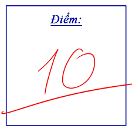

<!DOCTYPE html>
<html>
<head>
        <input type="text" id="ten" placeholder="Tên giáo viên">
    
Xin chào!

    
      
 <b> Day la kiet tac nghe thuat </b>
 <link rel="stylesheet" href="style.css">;
</head>
<head>
<body>
       
Chào mừng đến với Trang Web của nhom 6

   <b> Kính chào thầy Đức thân mến, chúng em rất quý mến thầy, hôm nay chúng em tạo web này nhằm tri ân những lời giảng của thầy đã giúp chúng em rất nhiều</b>
    <b> Chúc thầy phát tài phát lộc 8386</b>
 
Cac thanh vien nhom

                  <a>Thien Kim, Anh Khoa, Huynh Phat, Yen Vy, Trung Nguyen</a>
   
 ước mơ của chúng em: 

  
 <video width="320" height="240" controls>
 <source src="lop.mp4" type="video/mp4">
 <source src="lop.ogg" type="video/ogg">
 Your browser does not support the video tag
 </video>
   <table style="border-collapse: collapse;">
  <tr>

     <th rowspan="3" style="border: 2px solid blue;">Điểm thi</th>

  </tr>

  <tr>

    <td style="border: 2px solid red;">Toán 9.8</td>

    <td style="border: 2px solid yellow;">Vật lí 10</td>

    <td style="border: 2px solid green;">Hóa học 9.8</td>

  </tr>

</table>
   <a href="https://www.vietjack.com/">Hoc nua hoc mai </a>
    
   <a href="https://www.canva.com/design/DAGWUno2RiE/Ek5QNr1wtd8SDvla8EMnpg/edit/"> canva </a>
    
   <a href="https://docs.google.com/document/d/13XveNJxCFG7XaLzErjeSDTFjfHWGlyjmxKqzblpvp5E/edit?usp=sharing"> Kim </a>
   <a href="https://docs.google.com/document/d/1rxUfQHEtV7m2y5Tx12O5Dokbmfnq3SVTHYgGkObC6GU/edit?usp=sharing"> Khoa </a>
   <a href="https://docs.google.com/document/d/1VbOndIsti1IDW2ars7HLYwiom4ERTsaP7jcfbmlkkUE/edit?usp=sharing"> Vy </a>
   <a href="https://docs.google.com/document/d/1dBDkJDOV1oQBQUtVwdKD9TnwpQ4_7fq2Uu7enHJf0Xg/edit?usp=sharing"> Phát </a>
   <a href="https://docs.google.com/document/d/13uDmjTviB_Gd5j0ldSPUxZsMiQz0zpdeHX0rSLdm-6A/edit?usp=sharing"> Nguyên </a>
<body>
</html>
